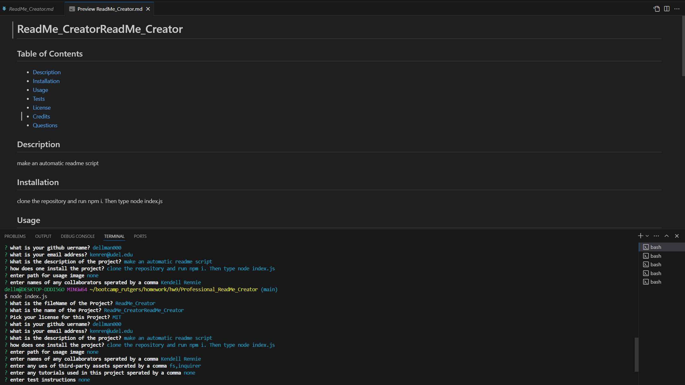

# ReadMe_CreatorReadMe_Creator 

## Table of Contents 
- [Description](#description)
- [Installation](#installation)
- [Usage](#usage)
- [Tests](#tests)
- [License](#license)
- [Credits](#credits)
- [Questions](#questions)

## Description
make an automatic readme script
## Installation
clone the repository and type npm i. Then type node index.js
## Usage

## Tests
none
## Credits
### Collaborators
Kendell Rennie  
 John Smith  
  
### third-party-programs
fs  
inquirer  

### Tutorials
Using Day.js in React  
Build a Dynamic CLI with Inquirer and Node.js: A Step-by-Step Guide  

## License
MIT
## Badges

## How to Contribute
If you like to contribute, my github username is dellman000

## Questions
If you have any questions, please contact me at kenren@udel.edu  
Link to my github profile page https://github.com/dellman000
 
    